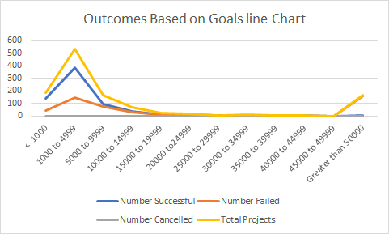

#An Analysis of Kickstarter Campaigns."
Module 1 Excel - Performing analysis on Kickstarter data to uncover trends
### Module1Challenge
## Conclusions:---
1. The most successful Kickstarter campaigns were started in May. On the other hand, December is not a great time to launch a campaign.
2. For Play subcategory, goal amount less than $5000 driving more successful campaigns, while goals more than $10000 but less than $50000 levels off with success and Failure.
3. For same play subcategory goal amount larger than 50,000, 99 percent campaigns failed.---
## Limitations ---
1. There are some Failed campaigns have really high goals (more than $50,000). It brings standard deviation on close to three times IQR.---
## Suggestions ---
1. Run the campaigns during the month of May and June for success.---
2. Run the campaigns with goals of less than $5000 to achieve higher rate of success.---

---

